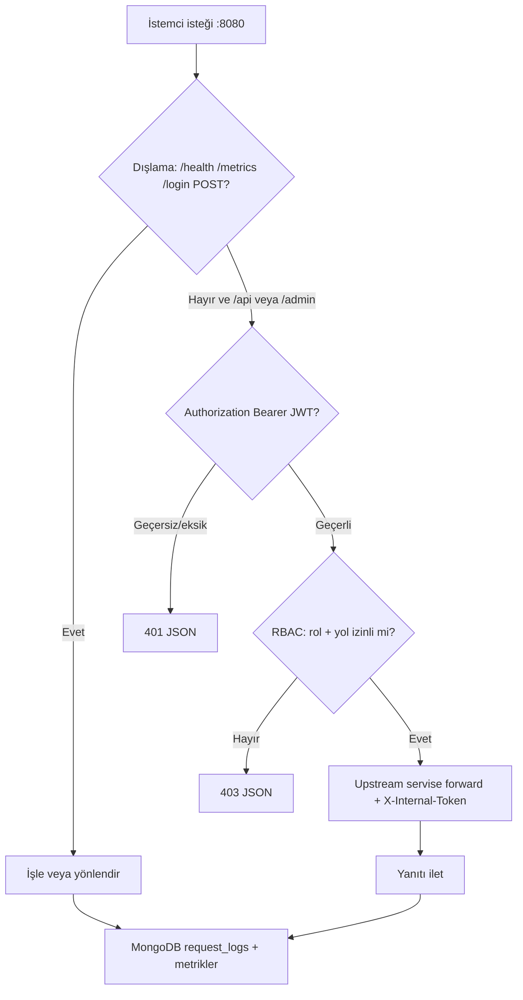
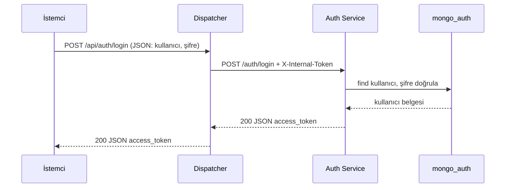
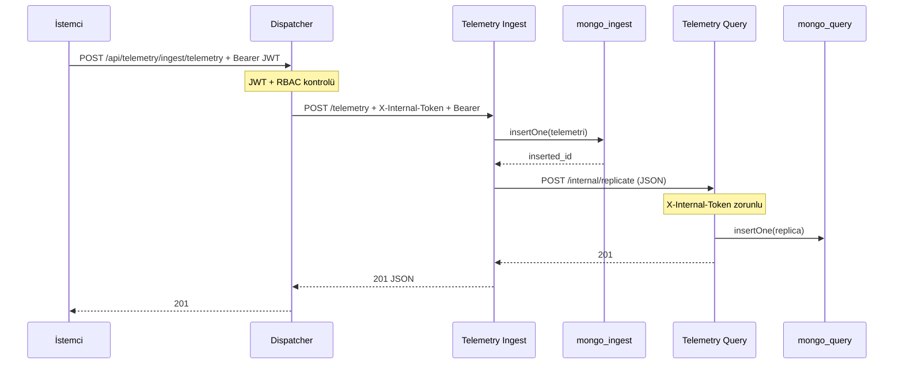
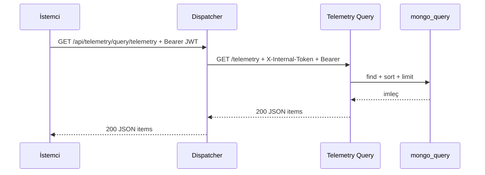
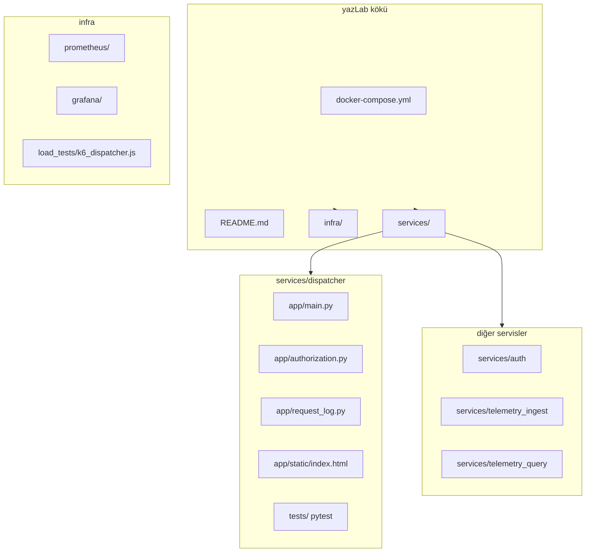
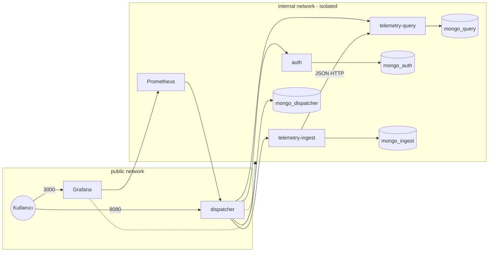

# Uydu Telemetri İzleme Sistemi (Mikroservis Mimarisi)

## 1. Kapak bilgileri

| | |
|---|---|
| **Proje adı** | Uydu Telemetri İzleme Sistemi — Dispatcher (API Gateway) ve Mikroservisler |
| **Ders / bağlam** | Yazılım Laboratuvarı — Dağıtık sistem, mikroservis, API Gateway |
| **Ekip üyeleri** | *[Muhammed Taha Kızıkoğlu, 241307121]* |
| **Tarih** | Nisan 2026 |

---

## 2. Giriş: problem tanımı ve amaç

### 2.1 Problem

Telemetri (batarya, sensör vb.) verisinin güvenle kaydedilip sorgulanması ve dışarıdan tek kapıdan erişim, laboratuvar kapsamında **mikroservis + API Gateway** yapısı ile kurulmuştur.

### 2.2 Amaç

- **API Gateway (Dispatcher):** Tüm dış isteklerin yönlendirildiği merkez; **merkezi yetkilendirme (RBAC)** ve **istek loglama**.
- **En az iki işlevsel mikroservis:** Bu projede **telemetri kabul (ingest)** ve **telemetri sorgulama (query)** servisleri.
- **Her servisin kendi NoSQL veritabanı:** Gerçek **MongoDB** motoru; servisler arası veri paylaşımı **JSON** ile HTTP üzerinden.
- **Ağ izolasyonu:** Mikroservisler yalnızca **iç Docker ağında**; dış dünyaya esas olarak yalnızca **Dispatcher** (ve gözlemlenebilirlik için **Grafana**) açılır.
- **Gözlemlenebilirlik:** Prometheus + Grafana ile trafik metrikleri; Dispatcher üzerinde **web arayüzü** ile telemetri işlemleri ve **detaylı log tablosu**.
- **Kalite:** Dispatcher geliştirmesinde **TDD (pytest)**; API tasarımında **REST** ve **Richardson Olgunluk Modeli (RMM) Seviye 2** ilkeleri.

---

## 3. Tasarım, REST, Richardson modeli, sınıf yapısı, diyagramlar ve analiz

### 3.1 REST ve Richardson Olgunluk Modeli (RMM)

**REST (Representational State Transfer),** kaynakların URI ile tanımlandığı ve durum geçişlerinin HTTP ile yapıldığı bir mimari stildir (Fielding, doktora tezi, 2000). **Richardson Maturity Model** (Richardson, blog yazıları — genelde dört seviye) REST’in ne kadar “RESTful” olduğunu ölçmek için kullanılır:

| Seviye | Özet |
|--------|------|
| 0 | Tek URI, tek HTTP metodu (ör. her şey POST) |
| 1 | Birden çok **kaynak (resource)** |
| 2 | **HTTP metotları** (GET, POST, PUT, DELETE) ve **durum kodları** (2xx, 4xx, 5xx) anlamlı kullanılır |
| 3 | HATEOAS (bağlantılarla keşif) |

Bu proje **Seviye 2** hedefiyle uyumludur:

- Kaynaklar yol ile ayrılır: örn. `/telemetry`, `/auth/login`, `/telemetry/{id}` (Dispatcher üzerinden `/api/...` önekleriyle).
- **GET** okuma, **POST** oluşturma (ör. telemetri gönderme `POST .../telemetry`) için kullanılır; silme/güncelleme ihtiyacı olmadığında ilgili uçlar tanımlanmamıştır.
- Hatalar **401, 403, 404, 503, 504** gibi uygun HTTP kodları ile döner; “her zaman 200 + JSON içinde hata” anti-pattern’i kullanılmaz.

### 3.2 Mikroservislerin çalışma mantığı (özet)

| Bileşen | İşlev |
|---------|--------|
| **Dispatcher** | JWT doğrulama, MongoDB’deki rol kurallarına göre **RBAC**, isteği ilgili servise HTTP ile iletme, `X-Internal-Token` ekleme, MongoDB’ye **request log**, Prometheus metrikleri |
| **Auth** | Kimlik doğrulama; kullanıcılar `mongo_auth` içinde; başarılı girişte **JWT** üretir; yalnızca iç ağ + geçerli iç token ile çağrılabilir |
| **Telemetry Ingest** | JSON telemetri kabulü; `mongo_ingest`’e yazar; **query** servisine JSON gövde ile **replicate** çağrısı yapar |
| **Telemetry Query** | Telemetri listeleme / tekil okuma; veri `mongo_query` içinde; iç replikasyon ucu `POST /internal/replicate` |

### 3.3 Nesne yönelimli yapı (Python / FastAPI)

Python modülleri **sınıf tabanlı** parçalar içerir:

- **Pydantic `BaseModel`** ile istek/yanıt şemaları (`LoginRequest`, `TelemetryIn`, `TokenResponse`, `ReplicateIn` vb.) — veri doğrulama ve tip güvenliği.
- **FastAPI `Depends`** ile ortak doğrulama (`require_internal`, `require_jwt`) bağımlılık enjeksiyonu gibi kullanılır.
- Dispatcher tarafında **`authorization`** ve **`request_log`** modülleri MongoDB erişimini kapsülleyen fonksiyon/sınıf kullanımıyla organize edilmiştir.

### 3.4 Akış — istek yaşam döngüsü (Dispatcher)



### 3.5 Sequence — oturum açma (Dispatcher → Auth)



### 3.6 Sequence — telemetri gönderme ve çoğaltma



### 3.7 Sequence — telemetri listeleme



### 3.8 Algoritmalar ve karmaşıklık (özet)

| İşlem | Karmaşıklık | Açıklama |
|--------|-------------|----------|
| RBAC kontrolü | O(P) | P = rol için tanımlı yol önek sayısı; küçük sabit |
| Telemetri listesi | O(L) | L = `limit` üst sınırı; Mongo indeks + sınırlı tarama |
| İstek logu yazma | O(1) | Tek belge ekleme (Mongo insert) |
| JWT doğrulama | O(1) | HS256 imza doğrulama, sabit zamanlı iş yükü |

### 3.9 Kısa literatür özeti

- **Fielding, R. T.** — *Architectural Styles and the Design of Network-based Software Architectures* (REST tanımı).
- **L. Richardson** — RMM (kaynak ve HTTP seviyeleri) üzerine yazılar; pratikte Seviye 2, çoğu kurumsal API için hedef seviye olarak kabul edilir.
- **Newman, S.** — *Building Microservices* — servis sınırları, veri sahipliği, dağıtık sistemlerde gözlemlenebilirlik.

---

## 4. Proje yapısı ve modüller (Mermaid)

### 4.1 Depo dizin yapısı



### 4.2 Çalışma zamanı — Docker servisleri ve ağ



### 4.3 Modül işlevleri (kısa)

| Yol | İşlev |
|-----|--------|
| `services/dispatcher/app/main.py` | FastAPI uygulaması, middleware (JWT + RBAC + log), route proxy, `/ui`, `/admin/logs`, `/metrics` |
| `services/dispatcher/app/authorization.py` | MongoDB rol-izin tablosu, `is_request_allowed` |
| `services/dispatcher/app/request_log.py` | İstek loglarının MongoDB’ye yazılması, yönetici JSON için sadeleştirilmiş satırlar |
| `services/dispatcher/app/static/index.html` | Kontrol paneli: Grafana linki, giriş, telemetri, log tablosu |
| `services/dispatcher/tests/` | Pytest ile TDD senaryoları |
| `services/auth/app/main.py` | Login, JWT, kullanıcı MongoDB |
| `services/telemetry_ingest/app/main.py` | POST telemetri, query’ye replicate |
| `services/telemetry_query/app/main.py` | GET liste/tekil, internal replicate |
| `infra/prometheus` | Dispatcher scrape |
| `infra/load_tests` | k6 yük testi betiği |

---

## 5. Uygulama, ekran görüntüleri, test senaryoları ve sonuçlar

### 5.1 Çalıştırma

Önkoşul: **Docker Desktop** (Windows).

```bash
docker compose up --build
```

Erişim adresleri:

| Açıklama | URL |
|----------|-----|
| Dispatcher | http://localhost:8080 |
| Web arayüzü (telemetri + log tablosu) | http://localhost:8080/ui |
| Grafana | http://localhost:3000 (varsayılan: admin / admin) |
| Sağlık kontrolü | http://localhost:8080/health |


 **Docker Compose:** Çalışan servisler listesi (`docker compose ps`) veya Docker Desktop ekranı — *iç servislerde host portu olmadığını* gösterir.
 

 **Ağ izolasyonu:** Mümkünse dışarıdan `auth:8000` vb. erişilemediğini gösteren deneme (bağlantı hatası) — *raporda açıklayın*.
 **`/ui`:** Giriş yapılmış hali, telemetri gönderme ve liste tablosu.
 **`/ui`:** Dispatcher trafik logları tablosu.
 **Grafana:** Dispatcher istek oranı / gecikme panosu.

 


### 5.3 Test senaryoları ve sonuçlar

#### 5.3.1 Birim / entegrasyon — Dispatcher (TDD, pytest)

Konum: `services/dispatcher/tests/`

```bash
cd services/dispatcher
python -m pytest -v
```

| Senaryo (özet) | Beklenen | Dosya |
|----------------|----------|--------|
| Sağlık uç noktası | 200, `{"status":"ok"}` | `test_dispatcher_health_and_errors.py` |
| Bilinmeyen yol | 404 (sahte 200 yok) | aynı |
| Korumalı yol, JWT yok | 401 | `test_dispatcher_auth_required.py` |
| Ingest / Query yönlendirme | Upstream yokken 503/504 veya 200 | `test_dispatcher_routing_contract.py` |

> Sonuç: Testler yeşil ise Dispatcher’ın **temel sözleşmesi** (sağlık, hata kodları, auth zorunluluğu, yönlendirme) doğrulanmış olur. Çıktı ekran görüntüsünü rapora ekleyin.

#### 5.3.2 Manuel uçtan uca senaryo

1. `POST /api/auth/login` ile token alın.
2. `POST /api/telemetry/ingest/telemetry` ile örnek telemetri gönderin.
3. `GET /api/telemetry/query/telemetry` ile listenin güncellendiğini doğrulayın.
4. Admin token ile `GET /admin/logs/json` veya `/ui` üzerinden log tablosunu kontrol edin.

#### 5.3.3 Yük testi (k6)

Araç: **k6** (Grafana). Betik: `infra/load_tests/k6_dispatcher.js`. İstek hedefi: Dispatcher üzerinden `GET /api/telemetry/query/ping` (JWT ile; her VU döngüde ping atıyor). Stack `docker compose` ile localhost’ta çalışırken test de aynı makineden verildi; sonuçlar donanıma ve eşzamanlı işlere bağlıdır.

**Komut (PowerShell, Windows):** Önce login ile token alındı, ardından 50 sanal kullanıcı ve 30 saniye süre kullanıldı. Bu ortamda `k6` komutu PATH’te olmadığı için çalıştırıcı tam yol verildi:

```powershell
$json = '{"username":"admin","password":"admin123"}'
$r = Invoke-RestMethod -Method Post -Uri "http://localhost:8080/api/auth/login" `
  -ContentType "application/json; charset=utf-8" `
  -Body ([System.Text.Encoding]::UTF8.GetBytes($json))

& "C:\Program Files\k6\k6.exe" run --vus 50 --duration 30s `
  --env JWT_TOKEN="$($r.access_token)" `
  .\infra\load_tests\k6_dispatcher.js
```

Betikte tanımlı eşikler (threshold): `http_req_failed` oranı %5’ten az, `http_req_duration` p(95) 2000 ms altı. Bu koşuda ikisi de geçti.

**Ölçülen sonuçlar (özet):**


| Metrik | Değer |
|--------|--------|
| Senaryo | 50 VU, 30 s |
| Toplam HTTP isteği | 2536 |
| İstek hızı (yaklaşık) | ~84,35 istek/s |
| Başarısız istek | 0 (%0) |
| Ortalama yanıt süresi | ~541 ms |
| Medyan | ~509 ms |
| p(90) | ~652 ms |
| p(95) | ~733 ms |
| Min / max | ~24 ms / ~1,13 s |
| Check başarısı | 2536/2536 (%100) |

**Kısa yorum:** Dispatcher bu yükte istekleri query servisine yönlendirmiş; hata oranı sıfır, p95 yaklaşık 0,73 s ve betiğin 2 s sınırının altında kalmış. Ortalamanın yüksek olması Docker + ağ + Mongo gecikmesi ve aynı makinede hem yük motoru hem stack’in çalışmasından da beklenir. Ödevin istediği 100 / 200 / 500 VU tablosu için aynı komutta `--vus` ve `--duration` değiştirilerek tekrarlanabilir; Grafana’dan aynı aralıkta metrik karşılaştırması yapılabilir.

---

## 6. Sonuç, tartışma, sınırlılıklar ve geliştirmeler

### 6.1 Başarılar

Dispatcher tek kapı; RBAC ve loglar `mongo_dispatcher` üzerinde. Dört Mongo örneği, iç ağda servisler, ingest–query arasında JSON ile replicate var. API tarafında RMM 2’ye yakın kaynak/HTTP kullanımı ve anlamlı durum kodları korunuyor. Prometheus + Grafana ve `/ui` ile trafik izlenebiliyor. Dispatcher davranışı pytest ile test ediliyor.

Yük testinde (k6, 50 VU / 30 s) hata oranı %0 ve p95 ≈ 733 ms çıktı; eşikler tuttu. Bu, gateway’in eşzamanlı ping trafiğini bu koşullarda karşılayabildiğini gösteriyor.

### 6.2 Sınırlılıklar

Grafana :3000 dışarı açık; “tek dış yüzey Dispatcher” beklentisi varsa bunu raporda not düşmek gerekir. Mikroservisler JWT’yi tekrar doğruluyor; rol/yol kararı yine Dispatcher’da, bu ayrımı anlatmak iyi olur. RMM 3 (HATEOAS) yok. Geliştirme ortamı sırları ve Mongo erişimi üretim için sıkılaştırılmalı.

Yük testi şu an tek profilde (50 VU); daha yüksek eşzamanlılık ve ingest POST karışımı ayrı denenmedi.

### 6.3 Olası geliştirmeler

- Grafana’yı yalnızca **internal** ağda tutup erişimi **Dispatcher ters proxy** ile vermek.
- **mTLS** veya servis mesh ile iç trafikte sertifika tabanlı güven.
- Telemetri için **Kafka / RabbitMQ** ile asenkron ingest ve tüketici tabanlı query güncelleme.
- **Open Policy Agent (OPA)** veya benzeri ile RBAC kurallarını harici politika motoruna taşıma.
- k6 senaryolarına **ingest POST** karışımı ve rapor için otomatik özet CSV/HTML çıktısı.

---

## Ek: Hızlı API referansı

```bash
# Login
curl -s -X POST "http://localhost:8080/api/auth/login" \
  -H "Content-Type: application/json" \
  -d "{\"username\":\"admin\",\"password\":\"admin123\"}"

# Telemetri gönder (TOKEN yerine jeton)
curl -s -X POST "http://localhost:8080/api/telemetry/ingest/telemetry" \
  -H "Authorization: Bearer TOKEN" \
  -H "Content-Type: application/json" \
  -d "{\"satellite_id\":\"SAT-1\",\"metric\":\"battery_v\",\"value\":12.4,\"unit\":\"V\"}"

# Liste
curl -s "http://localhost:8080/api/telemetry/query/telemetry" \
  -H "Authorization: Bearer TOKEN"
```

**PowerShell login** (UTF-8 gövde):

```powershell
$json = '{"username":"admin","password":"admin123"}'
$r = Invoke-RestMethod -Method Post -Uri "http://localhost:8080/api/auth/login" `
  -ContentType "application/json; charset=utf-8" `
  -Body ([System.Text.Encoding]::UTF8.GetBytes($json))
$r.access_token
```

---

Dispatcher tarafında TDD için pytest kullanıldı; ders gereği testlerin kodla birlikte (veya önce) tutulması beklenir.
